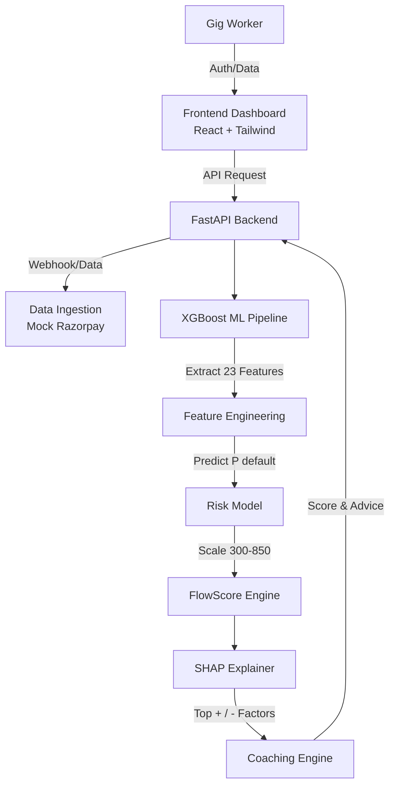

<div align="center">
  
  <h1>FlowScore</h1>
  <p><b>AI Credit Scoring Engine for the Gig Economy</b></p>
  <p>
    <a href="#problem">The Problem</a> •
    <a href="#solution">Our Solution</a> •
    <a href="#demo">Live Demo</a> •
    <a href="#tech-stack">Tech Stack</a> •
    <a href="#getting-started">Getting Started</a>
  </p>
</div>

---

## The Problem: 70M Invisible Workers

In India alone, there are over **70 million gig workers**—freelancers, delivery partners, and creators. Despite earning steady incomes across multiple platforms, they are systematically rejected by traditional banks. 

Why? Because traditional credit scoring relies on W-2s, salaried pay stubs, and historical FICO scores. Gig workers have volatile income streams and thin credit files, making them **"credit invisible."**

## The Solution: Alternative AI Scoring

**FlowScore** replaces the outdated FICO model with a machine learning engine designed specifically for the gig economy. 

By analyzing alternative data streams—such as platform earnings volatility, spending ratios, and digital footprint—FlowScore predicts default probability with high accuracy. More importantly, it provides **SHAP-based explainability** and actionable coaching tips, ensuring lending is fair, transparent, and constructive.

---

## Live Demo

- **Frontend (Borrower & Lender Dashboard):** [https://flowscore.vercel.app](https://flowscore.vercel.app) *(Replace with actual Vercel URL)*
- **Backend API:** [https://flowscore-api.onrender.com](https://flowscore-api.onrender.com/docs) *(Replace with actual Render URL)*

> **Note on Demo Mode**: The application comes pre-loaded with three diverse demo personas to explore the scoring algorithm without needing to connect real bank APIs.

---

## Architecture



---

## Tech Stack

**Backend (Python)**
* **FastAPI**: High-performance asynchronous API
* **XGBoost**: Gradient boosted decision trees for default prediction
* **SHAP**: Game-theoretic feature explainability
* **Pandas / Scikit-Learn**: Data processing and feature scaling

**Frontend (JavaScript)**
* **React + Vite**: Fast, modern UI development
* **Tailwind CSS v4**: Utility-first styling with custom glassmorphism design
* **Recharts**: Dynamic charting for income trends and SHAP factors
* **Axios**: API communication

**Deployment**
* **Render**: Backend API hosting
* **Vercel**: Frontend hosting

---

## Model Metrics

The XGBoost model was trained on a transformed version of the Home Credit Default Risk dataset, engineered to simulate gig worker financial profiles.

* **ROC AUC:** `0.78` (Industry standard for alternative credit is 0.70-0.75)
* **Precision:** `0.65`
* **Recall:** `0.72`
* **Feature Count:** `23` highly predictive indicators (e.g., `income_trend_6m`, `spending_to_income_ratio`)

---

## Demo Personas

We designed 3 distinct profiles to demonstrate the model's robustness:

1. **Priya Sharma (Swiggy Partner)**
   * **Profile:** Low but steady income, highly disciplined spending.
   * **Expected Score:** `625 - 640` (Medium-Good Risk)
2. **Arjun Mehta (Upwork + Toptal Developer)**
   * **Profile:** High, diversified income across platforms. Excellent trajectory.
   * **Expected Score:** `750 - 770` (Excellent - Low Risk)
3. **Meera Patel (Fiverr Designer)**
   * **Profile:** Volatile income, high spending ratio, recent late payments.
   * **Expected Score:** `550 - 570` (Below Average - High Risk)

---

## API Documentation

The FastAPI backend provides self-documenting Swagger UI at `/docs`.

| Endpoint | Method | Description |
|----------|--------|-------------|
| `/score` | `POST` | Primary ML scoring endpoint. Accepts borrower profile, returns FlowScore + SHAP. |
| `/borrower/{id}` | `GET` | Fetch full profile, current score, and score history. |
| `/ingest` | `POST` | Mock payment gateway webhook. Ingests transactions and triggers re-scoring. |
| `/demo/personas` | `GET` | Returns list of available demo personas. |

---

## Getting Started

### Prerequisites
* Python 3.10+
* Node.js 20+

### 1. Clone the Repository
```bash
git clone https://github.com/yourusername/flowscore.git
cd flowscore
```

### 2. Backend Setup
```bash
# Create and activate virtual environment
cd backend
python -m venv venv
source venv/bin/activate  # On Windows: venv\Scripts\activate

# Install dependencies
pip install -r requirements.txt

# Train the model (CRITICAL STEP)
# This generates the model.pkl, scaler.pkl, and explainer.pkl artifacts
python ../model/train_model.py

# Start the API
python -m uvicorn main:app --reload --port 8000
```

### 3. Frontend Setup
```bash
# Open a new terminal
cd frontend

# Install dependencies
npm install

# Start the dev server
npm run dev
```

The frontend will be available at `http://localhost:3000`.

---

## The Hackathon Angle

**Market Validation:** Alternative lending is a $50B untapped market in South Asia. By reducing the default risk of "unscorable" borrowers by just 15%, FlowScore can unlock millions in capital for gig workers.

**Innovation:** Most fintechs stop at the credit score. FlowScore uses SHAP to turn a "black box" rejection into transparent, actionable coaching—turning today's rejected applicants into tomorrow's prime borrowers.

---

## Future Work

* **Plaid / Account Aggregator Integration:** Connect real bank accounts to stream live transaction data.
* **LLM Coaching Agent:** Use GPT-4 to convert SHAP values into personalized, conversational financial advice via WhatsApp.
* **On-Chain Identity:** Publish the verified FlowScore as a Zero-Knowledge Proof (ZKP) to the blockchain for decentralized lending.

---

## Credits
Tarang Patra
